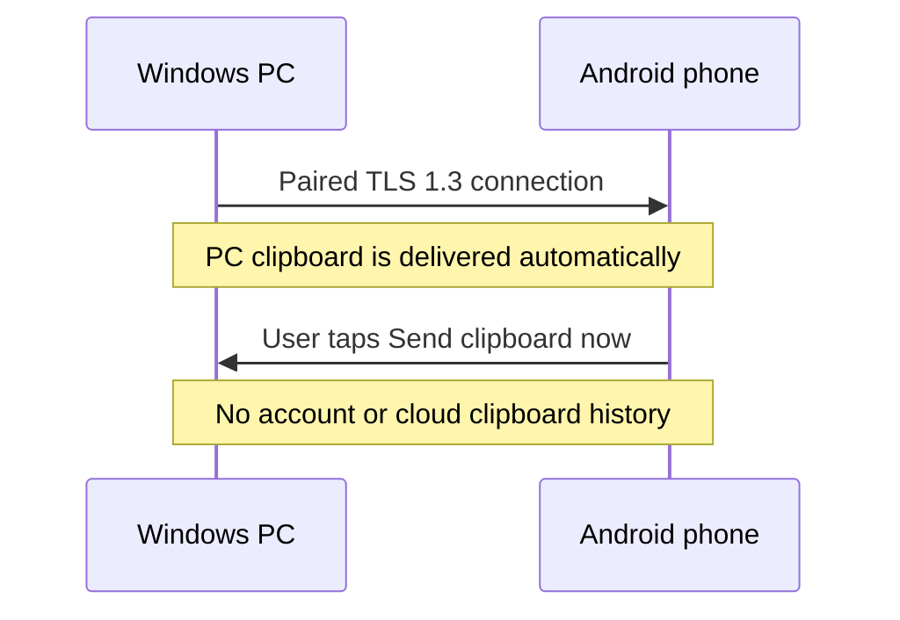

# FerryClip

<p align="center">
	
</p>

<h3 align="center">Your clipboard, in sync. Your devices, still yours.</h3>

<p align="center">
	
</p>

<p align="center">
	
	
	
	
</p>

FerryClip keeps the clipboard moving between a Windows PC and an Android phone on the same Wi-Fi, mobile/PC hotspot, or local VPN. No internet connection, account, or cloud clipboard history is required.

> **Testing build:** the Android APK is debug-signed and the Windows self-contained EXE is unsigned. These are beta builds for manual testing, not production releases. Android secure sync requires a TLS 1.3-capable device (Android 10+ on the current implementation).

## The flow

| Windows to Android | Android to Windows |
| --- | --- |
| Copy on the PC. Text syncs automatically while connected; paste it on the unlocked phone. | Copy on the phone, then tap **Send clipboard now** in the notification or **Send to PC** in Quick Settings. |
| No phone-side tap for incoming PC text. | Copying alone never sends clipboard content. |



## What it does

- **Pairs explicitly:** enter the short-lived six-digit code generated by the Windows PC; successful pairing connects that PC automatically.
- **Keeps devices separate:** encrypted multi-PC storage, identity pinning, and independent Connect/Disconnect, Pause/Resume, and Forget actions for every PC.
- **Finds the connection again:** local discovery, reconnect, and a selected-device-only recovery policy.
- **Keeps sending intentional:** Android never silently reads clipboard changes to send them to the PC.
- **Stays local:** no account, cloud clipboard history, USB, root, helper app, Developer options, or keyboard switching.

Clipboard sync is text-only. Images and automatic hotspot management are not included. Android may show its own clipboard privacy indicator; FerryClip cannot suppress operating-system UI.

## Get connected

1. Install the matching Windows and Android builds, then connect both devices to the same Wi-Fi, mobile/PC hotspot, or local VPN; internet access is not needed.
2. In the Windows tray app, choose **Pair new device**. In FerryClip on Android, enter the six-digit code shown on the PC.
3. FerryClip finds the PC on the reachable local network, verifies its identity, and connects it automatically after pairing.
4. Manage each PC from its tile. Copy on Windows and paste on the unlocked phone.
5. To send the other way, copy on Android and tap the notification action or Quick Settings tile.

The Android app includes an onboarding guide for optional permissions and adding the Quick Settings tile. The notification action is an alternative; adding the tile is optional.

## Build from source

**Tooling:** .NET 10 SDK, JDK 17, Android SDK Platform 34, and PowerShell. Node.js is only needed to build or preview the website.

```powershell
# Build the Windows app and Android beta APK
.\scripts\build-windows.ps1
.\scripts\build-android.ps1

# Build the compact Windows installer
.\scripts\build-windows-download.ps1

# Optional: build and preview the website
node site/build.cjs
node site/serve.cjs
```

The Android build creates a debug-signed APK. The Windows build creates a self-contained FerryClip-win-x64.exe that runs without a separate .NET installation or internet access. The optional compact installer may bootstrap the official .NET 10 Desktop Runtime if needed. Build outputs are written under the locally ignored `dist/` directory. Quit an existing Windows tray instance before launching a replacement.

## Privacy and troubleshooting

Android's enabled foreground service supports background connection recovery. Android requires an explicit user action to read and send phone clipboard text. Incoming text queued while the phone is locked is held in memory; pending text can be lost if the service or process stops. Pause stops sync in both directions.

For diagnostics, use **Advanced → Diagnostics → Share logs / Save to Downloads** on Android or **Open Log Folder** from the Windows tray menu. When reporting an issue, include the app versions, network mode, test step, and expected versus actual result. Do not send private clipboard text.

The animated headline above is decorative and hosted by [readme-typing-svg](https://github.com/DenverCoder1/readme-typing-svg); it does not run code from this repository.

<p align="center">
	<a href="https://github.com/Tanishktewetia/FerryClip/issues">Report a problem</a>
	&nbsp;·&nbsp;
	<a href="site/index.html">Explore the product walkthrough</a>
</p>
